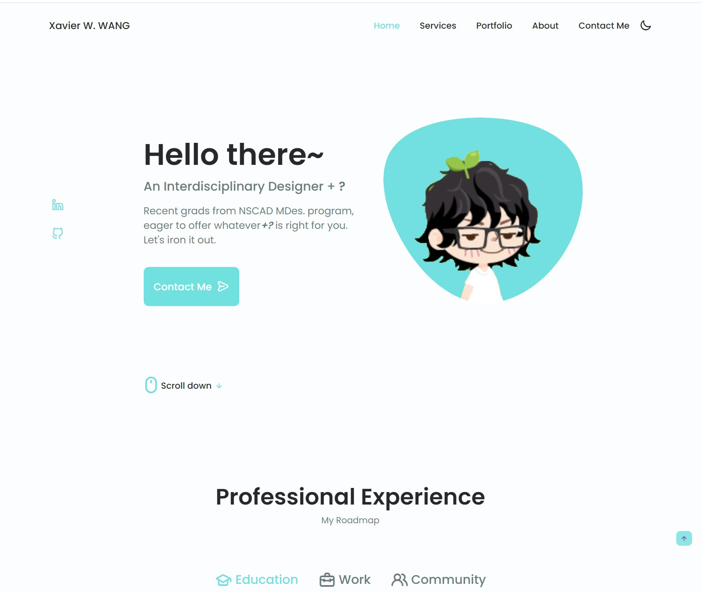

# Demo-Portfolio
The bare minimum of markup and JS

 | 1.Community section;
 | 2.Services section;
 | 3.Portfolio section; slideshow
 | 4.About Me section;
 | 5. Optimize Contact Me;
 
See demo <a href="https://xavier-ww.github.io/Portfolio-Demo/" target="_blank">here on Github pages</a>\
Preview: 

    <table>
	    <tr>
    	    <td style="padding:10px">
        	    
      	    </td>
            <td style="padding:10px">
            	
            </td>
        </tr>
    </table>

